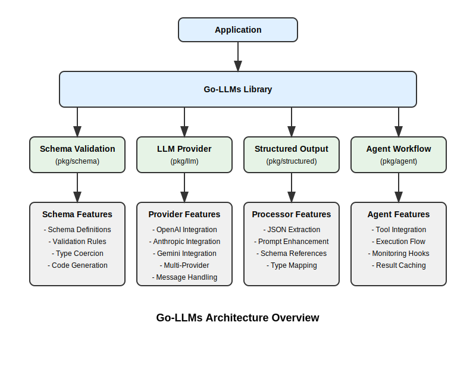

# Go-LLMs: A Unified Go Library for LLM Integration
Was looking for a way to talk to various llm provider via go, but didn't want heavy sdk dependencies. Also didn't want largish agentic frameworks, most of which are good. They were too much to handle.

At the end of the day, ended up creating this framework/library to use internally. 

Please use at your own risk, it's used internally by me. Will try to minimize library API changes as the needs evolve, but no guarantees. 

I do have to acknowledge help from various llm based coding tools, esp in documentation and testing - aider, claude code, chatgtp, claude desktop, gemini code. thnx much. Much kudos to the various forums/communities in reddit, hackernews, x (twitter) and youtube, mucho gracias for insights. and google - search still rocks.

## Introduction

Go-LLMs is a Go library that provides a simplified, unified interface to interact with various LLM providers while offering robust data validation and agent tooling. It combines structured output processing (inspired by pydantic-ai), a consistent provider interface, and flexible agent workflows in a single, cohesive Go package.

## Features

- **Structured responses**: Validates LLM outputs against predefined schemas
- **Model-agnostic interface**: Provides a unified API across different LLM providers
- **Type safety**: Leverages Go's type system for better developer experience
- **Dependency injection**: Enables passing data and services into agents
- **Tool integration**: Allows LLMs to interact with external systems through function calls
- **Multiple providers**: Support for OpenAI, Anthropic, Google Gemini, and OpenAI API compatible providers (like OpenRouter and Ollama)
- **Multimodal content**: Support for text, images, files, videos, and audio in messages
- **Provider options system**: Configure providers with type-safe interface-based options (common and provider-specific)
- **Environment variable support**: Configure providers through environment variables and option factories
- **Schema validation**: Comprehensive JSON schema validation with type coercion
- **Monitoring hooks**: Hooks for logging, metrics, and debugging
- **Multi-provider strategies**: Combine providers using fastest, primary, or consensus approaches
- **Convenience utilities**: Helpful functions for common operations and patterns

## Project Goals

1. Provide a unified, idiomatic Go interface for LLM integration
2. Implement robust schema validation and structured output processing
3. Support modern LLM providers (OpenAI, Anthropic, Google Gemini, etc.)
4. Create flexible agent workflows with tool integration
5. Minimize external dependencies by leveraging Go's standard library
6. Follow clean architecture principles with vertical feature slices

## Architecture

### Overview

Go-LLMs is built around several key components that work together to provide a comprehensive solution for working with LLMs in Go applications.



The architecture follows a vertical slicing approach where code is organized by feature:

```
go-llms/
├── cmd/                       # Application entry points
│   └── examples/              # Example applications
├── internal/                  # Internal packages
├── pkg/                       # Public packages
│   ├── schema/                # Schema definition and validation
│   │   ├── domain/            # Core domain models and interfaces
│   │   ├── validation/        # Validation implementation
│   │   └── adapter/           # Schema generation from Go structs
│   ├── llm/                   # LLM integration
│   │   ├── domain/            # Core domain models and interfaces
│   │   ├── provider/          # Provider implementations (OpenAI, Anthropic, Gemini)
│   │   └── prompt/            # Prompt templates and formatting
│   ├── structured/            # Structured output processing
│   │   ├── domain/            # Core domain models and interfaces
│   │   ├── processor/         # JSON extraction and validation
│   │   └── adapter/           # External format adapters
│   └── agent/                 # Agent orchestration
│       ├── domain/            # Core domain models and interfaces
│       ├── tools/             # Tool implementations
│       └── workflow/          # Agent execution flow
└── examples/                  # Usage examples
```

### Data Flow

This diagram shows how data flows through the system when generating structured outputs:


1. The application sends a request to an LLM provider
2. The provider formats the request for the external LLM API
3. The raw response from the LLM is returned to the provider
4. The structured output processor extracts structured data
5. The schema validator validates the extracted data
6. The valid result is returned to the application

### Agent Workflow

When using agents with tools, the flow of execution follows this pattern:


The agent coordinates between:
- The LLM provider for generating responses
- Tools for performing specific operations
- Hooks for monitoring and logging
- User input/output handling

### Multi-Provider Strategies

Go-LLMs supports multiple strategies for working with several LLM providers simultaneously:


- **Fastest Strategy**: Uses the first provider to respond
- **Primary Strategy**: Tries the primary provider first, with fallbacks
- **Consensus Strategy**: Compares results from multiple providers to determine the best response

## Installation

```bash
go get github.com/lexlapax/go-llms
```

## Basic Usage

### Schema Validation

```go
// Define a schema for validation
schema := &domain.Schema{
    Type: "object",
    Properties: map[string]domain.Property{
        "name":  {Type: "string", Description: "Person's name"},
        "age":   {Type: "integer", Minimum: float64Ptr(0), Maximum: float64Ptr(120)},
        "email": {Type: "string", Format: "email", Description: "Email address"},
    },
    Required: []string{"name", "email"},
}

// Create a validator
validator := validation.NewValidator()

// Validate JSON data against the schema
result, err := validator.Validate(schema, `{"name": "John Doe", "age": 30, "email": "john@example.com"}`)
if err != nil {
    log.Fatalf("Validation error: %v", err)
}

fmt.Printf("Validation result: %v\n", result.Valid)
```

### Using LLM Providers

```go
// Create an OpenAI provider with the modern gpt-4o model
provider := provider.NewOpenAIProvider(
    os.Getenv("OPENAI_API_KEY"),
    "gpt-4o",
)

// Generate text with a simple prompt
response, err := provider.Generate(context.Background(), "Explain quantum computing")
if err != nil {
    log.Fatalf("Generation error: %v", err)
}

fmt.Printf("Response: %s\n", response)

// Generate structured output with schema validation
result, err := provider.GenerateWithSchema(
    context.Background(),
    "Generate information about a person",
    schema,
)
if err != nil {
    log.Fatalf("Structured generation error: %v", err)
}

// Access the structured result
person := result.(map[string]interface{})
fmt.Printf("Generated person: %s (%d)\n", person["name"], person["age"])
```

### Using Multimodal Content

```go
// Create a provider that supports multimodal content
provider := provider.NewOpenAIProvider(
    os.Getenv("OPENAI_API_KEY"),
    "gpt-4o",
)

// Load an image
imageData, err := os.ReadFile("image.jpg")
if err != nil {
    log.Fatalf("Failed to read image: %v", err)
}

// Create a message with text and image content
message := domain.NewImageMessage(
    domain.RoleUser,
    imageData,
    "image/jpeg",
    "What's in this image?",
)

// Generate a response with the multimodal message
response, err := provider.GenerateWithMessages(
    context.Background(),
    []domain.Message{message},
)
if err != nil {
    log.Fatalf("Generation error: %v", err)
}

fmt.Printf("Response: %s\n", response)

// You can also use a URL for images
urlMessage := domain.NewImageURLMessage(
    domain.RoleUser,
    "https://example.com/image.jpg",
    "Describe this image",
)

// Or attach files (like PDFs, documents)
fileData, _ := os.ReadFile("document.pdf")
fileMessage := domain.NewFileMessage(
    domain.RoleUser,
    "document.pdf",
    fileData,
    "application/pdf",
    "Summarize this document",
)
```

### Configuring Providers with Options

```go
// Create an HTTP client with custom timeout
httpClient := &http.Client{
    Timeout: 30 * time.Second,
}

// Create common options that work for any provider
httpClientOption := domain.NewHTTPClientOption(httpClient)
timeoutOption := domain.NewTimeoutOption(15000) // 15 seconds

// Create provider-specific options
systemPromptOption := domain.NewAnthropicSystemPromptOption(
    "You are a helpful assistant who speaks in a very concise way.")

// Create provider with options
anthropicProvider := provider.NewAnthropicProvider(
    os.Getenv("ANTHROPIC_API_KEY"),
    "claude-3-5-sonnet-latest",
    httpClientOption,         // Common option
    timeoutOption,            // Common option
    systemPromptOption,       // Anthropic-specific option
)

// Generate with the configured provider
response, err := anthropicProvider.Generate(
    context.Background(),
    "Explain the theory of relativity",
)
```

### Processing Structured Outputs

```go
// Create a JSON processor
processor := processor.NewJsonProcessor()

// Process raw LLM output containing JSON
rawOutput := `I'll create a person profile for you:
{
  "name": "Jane Smith",
  "age": 35,
  "email": "jane.smith@example.com"
}
Hope this helps!`

// Extract and validate the JSON
data, err := processor.Process(schema, rawOutput)
if err != nil {
    log.Fatalf("Processing error: %v", err)
}

// Or map directly to a struct
type Person struct {
    Name  string `json:"name"`
    Age   int    `json:"age"`
    Email string `json:"email"`
}

var person Person
err = processor.ProcessTyped(schema, rawOutput, &person)
if err != nil {
    log.Fatalf("Processing error: %v", err)
}

fmt.Printf("Person: %s (%d)\n", person.Name, person.Age)
```

### Multi-Provider Strategies

```go
// Create multiple providers
openaiProvider := provider.NewOpenAIProvider(os.Getenv("OPENAI_API_KEY"), "gpt-4o")
anthropicProvider := provider.NewAnthropicProvider(os.Getenv("ANTHROPIC_API_KEY"), "claude-3-5-sonnet-latest")
geminiProvider := provider.NewGeminiProvider(os.Getenv("GEMINI_API_KEY"), "gemini-2.0-flash-lite")

// Create provider weights
providers := []provider.ProviderWeight{
    {Provider: openaiProvider, Weight: 1.0, Name: "openai"},
    {Provider: anthropicProvider, Weight: 1.0, Name: "anthropic"},
    {Provider: geminiProvider, Weight: 1.0, Name: "gemini"},
}

// Create a multi-provider with the fastest strategy
fastestProvider := provider.NewMultiProvider(providers, provider.StrategyFastest)

// Or with the primary strategy (with fallback)
primaryProvider := provider.NewMultiProvider(providers, provider.StrategyPrimary).
    WithPrimaryProvider(0) // Use first provider as primary

// Or with consensus strategy
consensusProvider := provider.NewMultiProvider(providers, provider.StrategyConsensus).
    WithConsensusStrategy(provider.ConsensusSimilarity).
    WithSimilarityThreshold(0.7)

// Use like any other provider
response, err := consensusProvider.Generate(context.Background(), "What are the three laws of robotics?")
```

### Using Agents with Tools

```go
// Create a provider
llmProvider := provider.NewOpenAIProvider(os.Getenv("OPENAI_API_KEY"), "gpt-4o")

// Create an agent with string output type
agent := workflow.NewAgent[struct{}, string](llmProvider).
    SetSystemPrompt("You are a helpful assistant with access to tools.")

// Add a calculator tool
agent.AddTool(tools.NewTool(
    "calculator",
    "Perform mathematical calculations",
    func(ctx context.Context, params map[string]interface{}) (interface{}, error) {
        expression, _ := params["expression"].(string)
        // Implement calculation...
        return result, nil
    },
))

// Add a logging hook
agent.AddHook(workflow.NewLoggingHook(slog.Default(), workflow.LogLevelDetailed))

// Run the agent
result, err := agent.Run(context.Background(), "What is the square root of 144?", struct{}{})
if err != nil {
    log.Fatalf("Agent error: %v", err)
}

fmt.Printf("Agent result: %v\n", result)
```

### Prompt Enhancement

```go
// Create a prompt enhancer
enhancer := processor.NewPromptEnhancer()

// Enhance a prompt with schema information
prompt := "Generate information about a person"
enhancedPrompt, err := enhancer.Enhance(prompt, schema)
if err != nil {
    log.Fatalf("Enhancement error: %v", err)
}

// Use the enhanced prompt with your LLM provider
response, err := provider.Generate(context.Background(), enhancedPrompt)
```

### Environment Variable Support

```go
// Set environment variables for configuration
os.Setenv("OPENAI_API_KEY", "your-api-key")
os.Setenv("OPENAI_MODEL", "gpt-4o")                // Default model
os.Setenv("OPENAI_ORGANIZATION", "org-123456")     // Organization ID
os.Setenv("OPENAI_BASE_URL", "https://custom.api") // Custom API endpoint
os.Setenv("LLM_HTTP_TIMEOUT", "30")                // Global HTTP timeout in seconds
os.Setenv("LLM_RETRY_ATTEMPTS", "3")               // Global retry attempts

// Create a provider using environment variables
// This will automatically apply all options from the environment
provider, providerName, modelName, err := llmutil.ProviderFromEnv()
if err != nil {
    log.Fatalf("Failed to create provider: %v", err)
}
fmt.Printf("Created %s provider with model %s\n", providerName, modelName)

// Use the configured provider
response, err := provider.Generate(context.Background(), "Hello, world!")
```

### Convenience Utilities

```go
// Create a provider from config with options
config := llmutil.ModelConfig{
    Provider: "openai",
    Model:    "gpt-4o",
    APIKey:   os.Getenv("OPENAI_API_KEY"),
    BaseURL:  "https://api.openai.com", // Creates a BaseURLOption
}
// Add provider-specific options
orgOption := domain.NewOpenAIOrganizationOption("org-123456")
provider, err := llmutil.CreateProvider(config, orgOption)

// Generate responses in parallel
prompts := []string{
    "What is the capital of France?",
    "Give me a recipe for pancakes",
    "How many planets are in our solar system?",
}
results, errors := llmutil.BatchGenerate(context.Background(), provider, prompts)

// Generate with retry for transient errors
result, err := llmutil.GenerateWithRetry(
    context.Background(),
    provider,
    "Write a haiku about programming",
    3, // max retries
)

// Create a provider pool for load balancing
providerPool := llmutil.NewProviderPool(
    []domain.Provider{provider1, provider2, provider3},
    llmutil.StrategyRoundRobin,
)

// Create an agent with common configuration
agentConfig := llmutil.AgentConfig{
    Provider:      provider,
    SystemPrompt:  "You are a helpful assistant with access to tools.",
    EnableCaching: true,
    Tools:         []agentDomain.Tool{calculatorTool},
    Hooks:         []agentDomain.Hook{workflow.NewMetricsHook()},
}
agent := llmutil.CreateAgent(agentConfig)

// Run an agent with timeout
result, err := llmutil.RunWithTimeout(
    agent,
    "What is 7 * 6?",
    10*time.Second, // timeout
)
```

See the `cmd/examples/` directory for more comprehensive examples.

## Documentation

Go-LLMs provides comprehensive documentation for users and contributors:

### User Guides

- [Getting Started](docs/user-guide/getting-started.md) - Introduction and basic usage examples
- [Provider Options](docs/user-guide/provider-options.md) - Using the provider option system for configuration
- [Multi-Provider Guide](docs/user-guide/multi-provider.md) - Working with multiple LLM providers
- [Multimodal Content](docs/user-guide/multimodal-content.md) - Working with text, images, files, and other media types
- [Advanced Validation](docs/user-guide/advanced-validation.md) - Advanced schema validation features
- [Error Handling](docs/user-guide/error-handling.md) - Error handling patterns and best practices

### API Documentation

- [API Overview](docs/api/README.md) - Overview of the API
- [Schema API](docs/api/schema.md) - Schema definition and validation
- [LLM API](docs/api/llm.md) - LLM provider integration
- [Structured API](docs/api/structured.md) - Structured output processing
- [Agent API](docs/api/agent.md) - Agent and tool functionality

### Technical Documentation

- [Architecture](docs/technical/architecture.md) - Overview of the library architecture
- [Performance Optimization](docs/technical/performance.md) - Performance optimization strategies
- [Multimodal Content Implementation](docs/technical/multimodal-content.md) - Implementation details for multimodal support
- [Sync.Pool Implementation](docs/technical/sync-pool.md) - Detailed guide on sync.Pool usage
- [Caching Mechanisms](docs/technical/caching.md) - Caching strategies and implementations
- [Concurrency Patterns](docs/technical/concurrency.md) - Thread safety and concurrent execution

### CLI Documentation

- [Command Line Interface](cmd/README.md) - Documentation for the Go-LLMs CLI

### Example Applications

The library includes several example applications that demonstrate key features:

- [Simple Example](cmd/examples/simple/README.md) - Basic usage with mock providers
- [Anthropic Example](cmd/examples/anthropic/README.md) - Integration with Anthropic Claude
- [OpenAI Example](cmd/examples/openai/README.md) - Integration with OpenAI models
- [Gemini Example](cmd/examples/gemini/README.md) - Integration with Google Gemini
- [Provider Options Example](cmd/examples/provider_options/README.md) - Using the provider option system
- [OpenAI API Compatible Providers](cmd/examples/openai_api_compatible_providers/README.md) - Using OpenRouter and Ollama
- [Multimodal Example](cmd/examples/multimodal/README.md) - Working with text, images, audio, and video content
- [Agent Example](cmd/examples/agent/README.md) - Agent with tools for complex tasks
- [Multi-Provider Example](cmd/examples/multi/README.md) - Working with multiple providers
- [Consensus Example](cmd/examples/consensus/README.md) - Multi-provider consensus strategies
- [Schema Example](cmd/examples/schema/README.md) - Schema generation from Go structs
- [Coercion Example](cmd/examples/coercion/README.md) - Type coercion for validation
- [Convenience Example](cmd/examples/convenience/README.md) - Utility functions for common tasks
- [Metrics Example](cmd/examples/metrics/README.md) - Performance monitoring and metrics

For a complete reference of all documentation, see the [REFERENCE.md](REFERENCE.md) file.

### Project Planning

The following documents provide insight into the project's design and planning:

- [Design Inspirations](docs/plan/design-inspirations.md) - Key inspirations and design decisions
- [Coding Practices](docs/plan/coding-practices.md) - Coding standards and guidelines for the project
- [Implementation Plan](docs/plan/implementation-plan.md) - Detailed implementation plan with phases and milestones

## Running Tests

Go-LLMs includes a comprehensive test suite with several environment variables to control test execution:

```bash
# Run all tests (excluding integration, provider, edge case, and stress tests)
make test

# Run all tests including integration tests
make test-all

# Run with environment variables to enable specific tests
ENABLE_OPENAPI_COMPATIBLE_API_TESTS=1 go test ./tests/integration/...  # Enable OpenAI API compatible provider tests

# Skip specific provider tests even when ENABLE_OPENAPI_COMPATIBLE_API_TESTS=1
SKIP_OPEN_ROUTER=1 ENABLE_OPENAPI_COMPATIBLE_API_TESTS=1 go test ./tests/integration/...
SKIP_OLLAMA=1 ENABLE_OPENAPI_COMPATIBLE_API_TESTS=1 go test ./tests/integration/...

# Run benchmarks
make benchmark
```

For more information on testing, see the [Testing Framework documentation](docs/technical/testing.md).

## Development Status

### Current Version: v0.2.0

The core functionality is fairly complete and working. However, APIs are subject to change to accommodate new unforeseen developments in upstream APIs.

#### Changelog

**v0.2.0 (Current)**
- ✅ Added multimodal content support
  - Support for text, images, files, videos, and audio in messages
  - Base64 encoding for binary data
  - Helper functions for creating different message types
  - Provider-specific conversions for OpenAI, Anthropic, and Gemini
- ✅ Complete test suite for multimodal content
- ✅ Documentation for multimodal implementation

**v0.1.0**
- Initial release with core functionality
- Provider implementations (OpenAI, Anthropic, Gemini)
- Schema validation system
- Structured output processing
- Multi-provider strategies
- Agent workflow system

#### Current Focus
1. Model Context Protocol support for Agents
2. Testing and performance optimization
   - Comprehensive test suite for error conditions
   - Benchmarks for remaining components
   - Stress testing for high-load scenarios
3. Performance profiling and optimization
   - Prompt processing and template expansion
   - Memory pooling for response types
4. API refinement based on usage feedback

For the latest status and upcoming features, see the [TODO.md](TODO.md) file.

## License

This project is licensed under the MIT License - see the [LICENSE](LICENSE) file for details.
